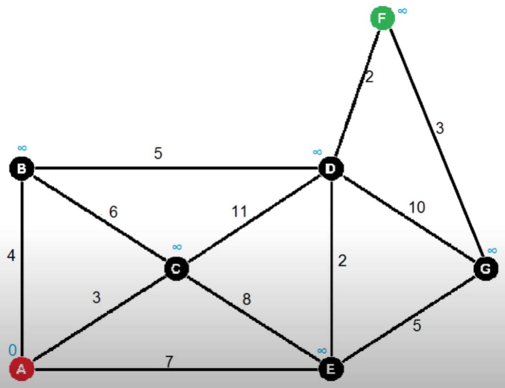

# Dijkstra's Algorithm

Dijkstra's Algorithm is an algorithm for finding the shortest paths between nodes in a graph, which may represent, for example, road networks. It was conceived by computer scientist Edsger W. Dijkstra in 1956 and published three years later.

> https://youtu.be/gdmfOwyQlcI

